# Algorithms-sandbox

A java application created to experiment with standard algorithms. 

The pipeline/concept is pretty straightforward : 
- An algorithm for the maze generation
- Another algorithm for solving it

Here are samples using Depth-first search for generation and A* for solving the maze:

| 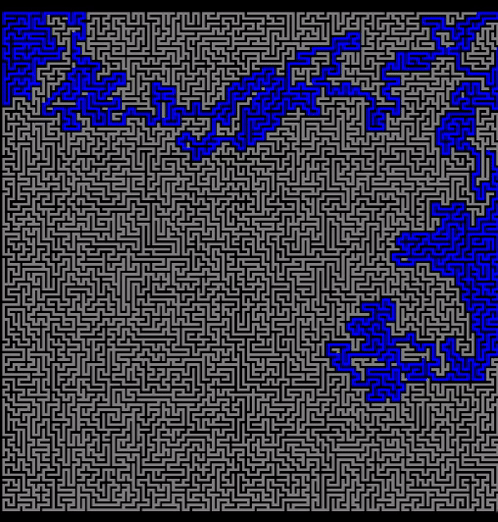 | 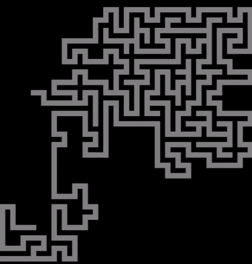 |
|------------|----------------|

| 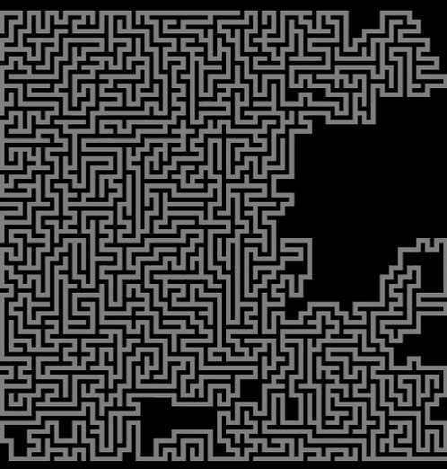 | 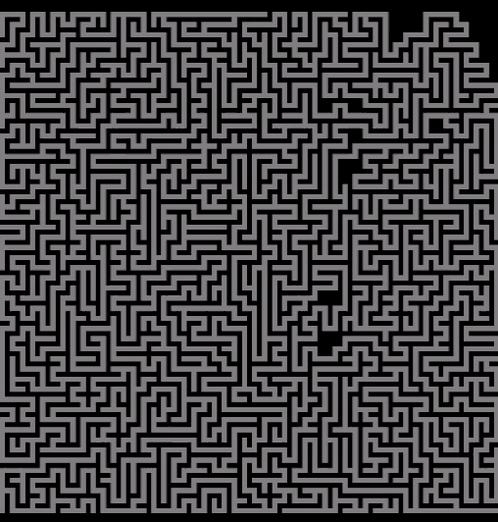 | 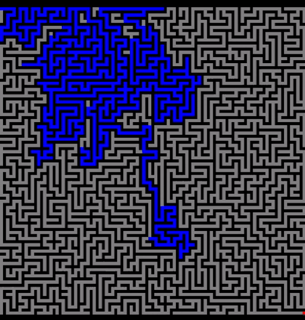 |
|----------------------------------------------|---------------------------------------------------|------------------------------------------------------|
| 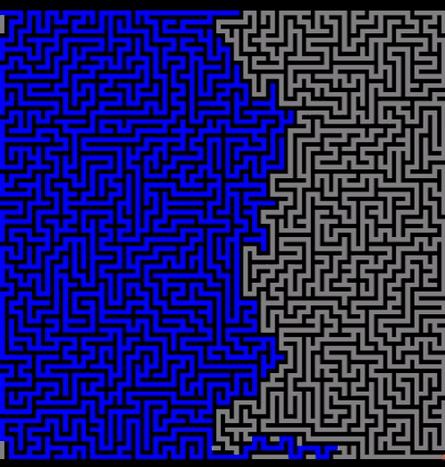 | 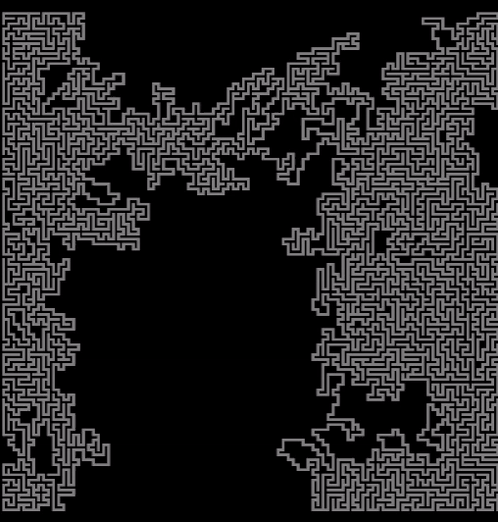 | 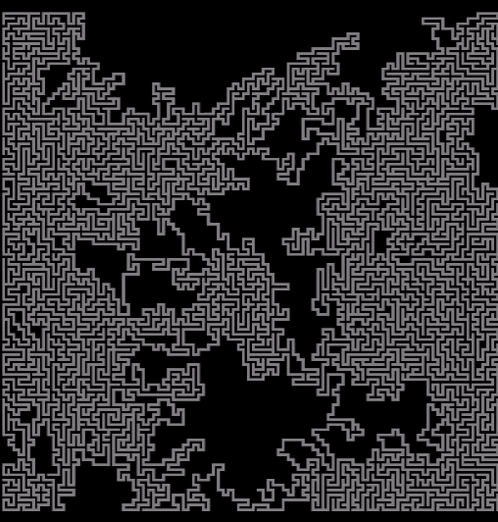 |
| 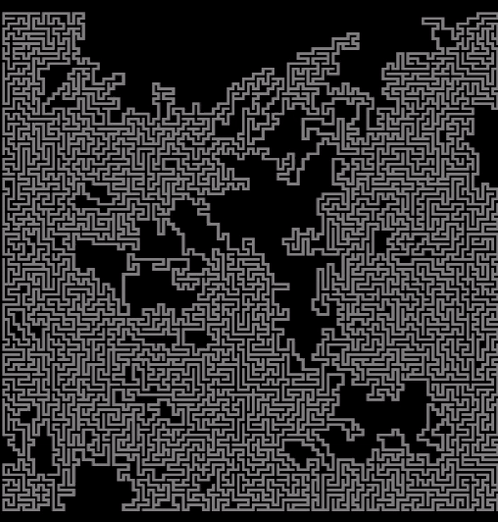 | 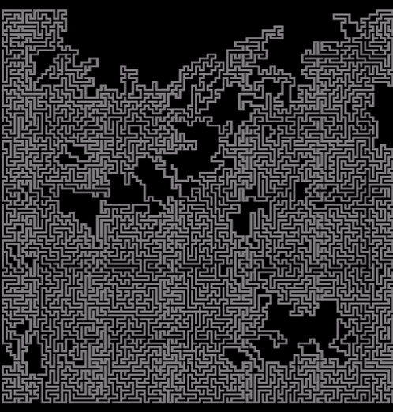 | 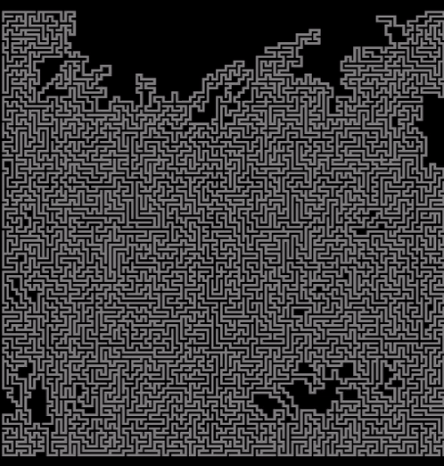 |
| 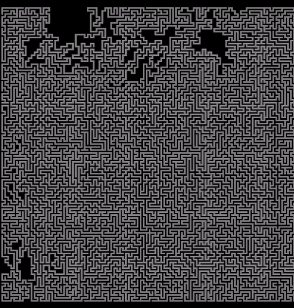 | 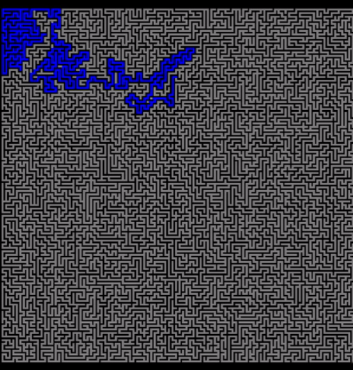 | 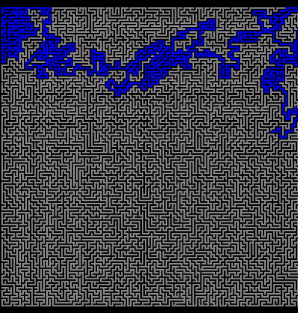 |

As both steps are animated (and can take a long time depending on the size of the maze), one can decide to skip the cool animation of the generation by setting the fast forward flag in the settings.java file. It is also possible to mess with the node/tile size or with the maze dimensions by modifying parameters in that same file.

Note that the start and end nodes are on the upper left corner and lower right corner respectively. Walls are pictured as black tiles, floor as gray, potential paths during the exploration are blue and final solution is green.
